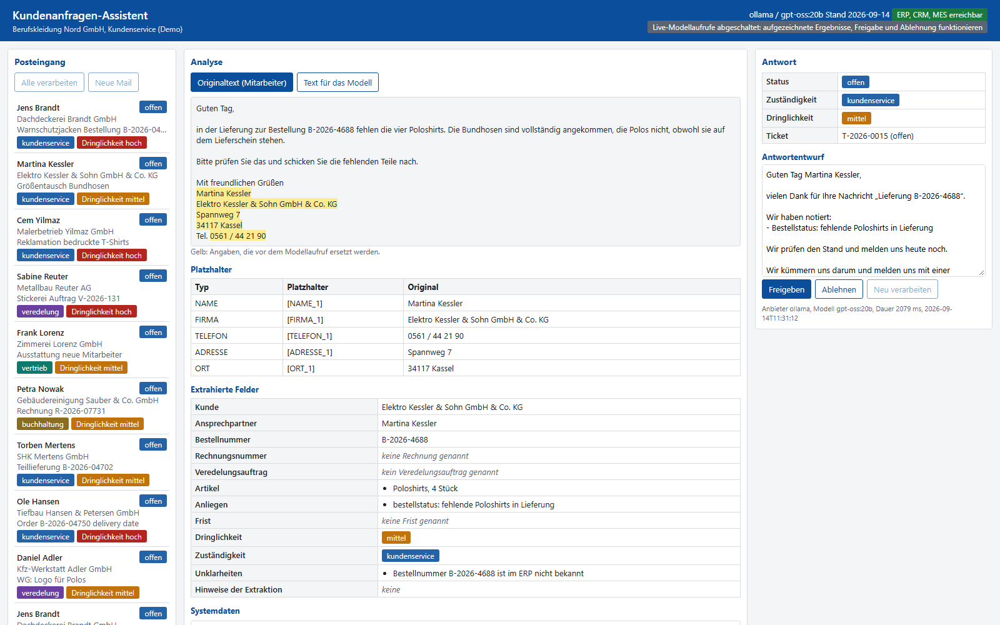

# Kundenanfragen-Assistent

[](https://github.com/dangtu1190-tech/kundenanfragen-assistent/actions/workflows/ci.yml)



## 1. Was das ist

Ein Assistent, der eingehende Kundenmails eines Berufsbekleidungs-Versenders
liest, sie vor dem Modellaufruf pseudonymisiert, die relevanten Angaben
strukturiert herauszieht, sie mit Daten aus ERP, CRM und MES anreichert, nach
festen Regeln priorisiert und zuweist, einen Antwortentwurf erzeugt und den
Vorgang als Ticket ins CRM schreibt. Abgedeckt sind Bestellstatus,
Rücksendung, Reklamation, Veredelung (Stick und Druck), Angebot, Rechnung und
Verfügbarkeit.

Der Versender heißt "Berufskleidung Nord GmbH" und ist erfunden, ebenso alle
Kunden. Eigenprojekt, Demo mit erfundenen Testdaten, entstanden für
Bewerbungen.

Der Schwerpunkt liegt auf der Integration, nicht auf dem Modell: klare
Schnittstellenverträge, Fehlertoleranz bei Systemausfall, Idempotenz beim
Schreiben, austauschbares Modell mit gemessener Qualität und ein
reproduzierbarer Cloud-Weg ohne laufende Kosten.

## 2. Demo im Browser ohne Installation

`https://dangtu1190-tech.github.io/kundenanfragen-assistent/`

Das ist der statische Modus: vorberechnete Ergebnisse aus `docs/data/`, keine
Modellaufrufe. Alle 15 Testmails lassen sich anklicken und zeigen den
kompletten Ablauf, also Pseudonymisierung mit Platzhaltertabelle, extrahierte
Felder, Systemdaten aus ERP, CRM und MES, Hinweise, Antwortentwurf und Ticket,
so wie sie beim letzten Echtlauf entstanden sind. Eine neue Mail live gegen ein
Modell rechnen zu lassen geht nur lokal (Abschnitt 7). Einzelne Fälle lassen sich
direkt verlinken, zum Beispiel `.../#m15` für den Tippfehler in der Bestellnummer.

## 3. Architektur

Sieben Schritte je Mail. Die Reihenfolge ist der Kern der Sache: das Modell
kommt in Schritt 2, es sieht ausschließlich Platzhalter, und die Fachsysteme
werden erst in Schritt 4 gefragt, also nach der Extraktion und nach dem
Zurücksetzen der Platzhalter. Es geht nie Kundentext an ein Fachsystem und nie
ein Systemdatensatz an das Modell.

```
                    Mail (data/mails.json)
                          |
                          v
  1. Pseudonymisierung    lokal, deterministische Regex.
     (anonymisierung.py)  E-Mail, Firma, Telefon, Adresse, Ort, Name
                          werden zu [EMAIL_1], [FIRMA_1], [NAME_1] ...
                          Kennungen (K-, B-, R-, V-, A-, SN-) bleiben stehen.
                          |
                          v
  2. Extraktion           >>> einziger Modellaufruf <<<
     (extraktion.py)      Eingabe: NUR der pseudonymisierte Text.
                          Ausgabe: JSON nach festem Schema (Pydantic).
                          |
                          v
  3. Zuruecksetzen        lokal, Platzhalter zurueck auf die Originalwerte,
     (anonymisierung.py)  rekursiv ueber das ganze JSON.
                          |
                          v
  4. Anreicherung         erst hier werden die Systeme gefragt,
     (anreicherung.py)    ueber die Adapter in app/integration/:
                          |
        +-----------------+------------------+
        |                 |                  |
        v                 v                  v
   +----------+     +-----------+      +-----------+
   |   ERP    |     |    CRM    |      |    MES    |
   |  /erp    |     |   /crm    |      |   /mes    |
   +----------+     +-----------+      +-----------+
   Kunde,           Kontakt zur        Veredelungs-
   Bestellung,      Absender-          auftrag,
   Artikel,         adresse,           Maschinen-
   Rechnung         Ticket             zustand
        |                 |                  |
        +-----------------+------------------+
                          |
                          v
  5. Regeln               Code, kein Modell: Zustaendigkeit aus den
     (regeln.py)          Kategorien, Dringlichkeit ueber Frist und
                          Reklamation, mit Begruendung im Ergebnis.
                          |
                          v
  6. Antwortentwurf       Vorlage je Kategorie aus dem Code,
     (antwort.py)         gefuellt mit den Systemdaten aus Schritt 4.
                          |
                          v
  7. CRM-Ticket           POST /crm/tickets, idempotent ueber
     (anreicherung.py)    externe_referenz = mail_id.
```

Die drei Systeme sind Mocks im Paket `systeme/` (eine FastAPI-App, drei
eingehängte Teil-Apps). Jedes hat eine eigene, im Browser lesbare
OpenAPI-Dokumentation unter `/erp/docs`, `/crm/docs` und `/mes/docs`. Die
Stammdaten liegen als JSON in `systeme/daten/`.

## 4. Pseudonymisierung vor dem Modellaufruf

Bevor eine Mail an das Modell geht, ersetzt eine deterministische
Regex-Erkennung personenbezogene Angaben durch Platzhalter. Das Modell sieht
nie den Originaltext. Es ist bewusst Pseudonymisierung und keine
Anonymisierung: die Zuordnungstabelle bleibt lokal und macht den Schritt
umkehrbar, an das Modell gehen ausschließlich die Platzhalter. (Das Modul heißt
aus der Entstehungsgeschichte heraus weiterhin `anonymisierung.py`.)

| Typ | Beispiel aus den Testdaten | Platzhalter |
|---|---|---|
| E-Mail | `p.nowak@sauber-co.example` | `[EMAIL_1]` |
| Firma | `Dachdeckerei Brandt GmbH` | `[FIRMA_1]` |
| Telefon | `0451 / 88 12 34` | `[TELEFON_1]` |
| Adresse | `Ziegeleiweg 18` | `[ADRESSE_1]` |
| Ort | `23552 Lübeck` | `[ORT_1]` |
| Name | `Jens Brandt` | `[NAME_1]` |

Dieselbe Angabe bekommt immer denselben Platzhalter, auch bei
unterschiedlicher Schreibweise (Groß- und Kleinschreibung, Namensteile). Die
Antwort des Modells enthält deshalb dieselben Platzhalter. Erst danach werden
sie anhand der Zuordnungstabelle wieder auf die Originalwerte zurückgesetzt,
rekursiv über das ganze JSON-Ergebnis. Ein Test in `tests/test_pipeline.py`
prüft scharf, dass kein Originalwert im Prompt auftaucht; er läuft in der CI
zusätzlich als eigener, benannter Schritt.

### Kennungen bleiben sichtbar

Kunden-, Bestell-, Rechnungs-, Veredelungs-, Artikel- und Sendungsnummern
werden bewusst nicht ersetzt. Sie sind keine personenbezogenen Daten, und das
Modell braucht sie wörtlich, um die Anfrage dem richtigen Vorgang zuzuordnen.
Damit das Telefonmuster sie nicht frisst, beginnt keine Kennung mit einer Null
oder einem Pluszeichen:

| Kennung | Format | Beispiel |
|---|---|---|
| Kundennummer | `K-1xxxx` | K-10234 |
| Bestellnummer | `B-2026-xxxxx` | B-2026-04711 |
| Rechnungsnummer | `R-2026-xxxxx` | R-2026-07731 |
| Veredelungsauftrag | `V-2026-xxx` | V-2026-131 |
| Artikelnummer | `A-4xxx` | A-4520 |
| Sendungsnummer | `SN-` und acht Zeichen | SN-7F3K9Q2L |
| Maschine | `STK-0x`, `DRK-0x`, `LAS-0x` | STK-01 |

`tests/test_kennungen.py` belegt für jede Kennungsart, dass sie die
Pseudonymisierung buchstabengetreu übersteht.

### Warum diese Felder und keine anderen

Firmennamen werden ersetzt, aber nicht in erster Linie aus Datenschutzgründen:
wer welche Berufskleidung in welcher Menge bestellt, welche Reklamationen es
gibt und welche Preise verhandelt werden, berührt Geschäftsgeheimnisse und ist
selbst schützenswert. Kennungen dagegen sind ohne die zugehörige
Stammdatenbank wertlos und für die Zuordnung unverzichtbar. Die Auswahl der zu
ersetzenden Felder ist damit eine Entscheidung je Anwendungsfall, keine
Pauschalregel, die sich unbesehen auf andere Domänen übertragen ließe.

### Ehrliche Grenzen

Namen, die im Fließtext ohne Anrede, Absenderfeld oder Signatur auftauchen,
werden nicht erkannt. Signaturen, die durchgehend klein geschrieben sind,
ebenfalls nicht, denn die Namenszeile wird über den Großbuchstaben am
Wortanfang gefunden. Teilen sich zwei erkannte Personen einen Nachnamen, bleibt
ein allein stehender Nachname stehen. Er ist nicht zuordenbar, und ein
geratener Platzhalter setzte die falsche Person wieder ein. Umgekehrt gilt: ist
nur eine Person mit diesem Nachnamen bekannt, wird auch der allein stehende
Nachname ersetzt und beim Zurücksetzen zum vollen Namen aufgefüllt. Orte ohne
vorangestellte PLZ bleiben stehen, und Ortsnamen mit Zusatz wie "am Main"
bleiben teilweise sichtbar: maskiert wird "60437 Frankfurt", das "am Main"
bleibt stehen. Ein Muster, das den Zusatz mitnimmt, verschluckt sonst
gewöhnlichen Fließtext und verdeckt damit eine Anrede, hinter der ein Name
steht. Firmennamen ohne Rechtsform im Namen (also ohne GmbH, AG, KG und
ähnliche Endungen) werden nur erkannt, wenn sie als Absenderfirma aus den
Mail-Metadaten bekannt sind. Taucht ein solcher Name nur im Fließtext auf, etwa
in einer Weiterleitung, bleibt er stehen.

Adress- und Ortsmuster zielen auf deutsche Schreibweisen: Straße mit
Hausnummer, fünfstellige PLZ vor dem Ort. Eine ausländische Anschrift fällt
durch. In m14 (Anfrage eines portugiesischen Herstellers) bleiben deshalb
"Rua da Fabrica 40", "4400-123 Vila Nova de Gaia" und "Portugal" im Klartext
stehen; Name, Firma, Telefonnummer und E-Mail-Adresse derselben Mail werden
weiterhin ersetzt. Ein Muster, das jede internationale Adressform trifft, gibt
es nicht. Der ehrliche Weg wäre, die Länderformate zu benennen, die tatsächlich
vorkommen, und alles andere vor der Weitergabe an ein Modell von einem Menschen
prüfen zu lassen, statt eine Abdeckung zu behaupten, die kein Regex hat.

## 5. Integrationsentscheidungen

**Dünne Adapter statt verstreuter HTTP-Aufrufe.** `app/integration/erp.py`,
`crm.py` und `mes.py` sind schmale Klassen auf einem gemeinsamen
`httpx.Client`. Nur dort steht, wie ein Fachsystem angesprochen wird; die
Pipeline kennt Methodennamen, keine URLs.

**Zeitlimit und ein Wiederholungsversuch.** Drei Sekunden je Aufruf
(`app/integration/verbindung.py`, `ZEITLIMIT`), bei Verbindungsfehler oder
Zeitüberschreitung ein zweiter Versuch (`ConnectError`, `ConnectTimeout`,
`ReadTimeout`, `PoolTimeout`). Danach ist Schluss. Mehr Wiederholungen
verlängern nur die Zeit bis zur Meldung, denn ein Fachsystem, das zweimal
nicht antwortet, ist selten beim dritten Mal da.

**Fehlerabbildung an genau einer Stelle.** HTTP 404 wird zu `None`, also "gibt
es nicht", ein normaler fachlicher Fall. Jede andere Antwort außerhalb von 2xx
wird zu `SystemNichtErreichbar(system, "HTTP <code>")`, Verbindungsabbrüche
ebenso. Auch 401 und 429 gehören dorthin und nicht zu `None`: ein abgelaufener
Zugang oder eine Drosselung ist kein fehlender Datensatz, und als `None` würde
die Anreicherung den Schritt still überspringen, statt den Ausfall in
`integrationsfehler` zu melden. Die aufrufende Schicht muss keine Statuscodes
kennen.

**Degradation statt Abbruch.** Fällt ein System aus, läuft die Verarbeitung
weiter. Der betroffene Schritt wird übersprungen, `integrationsfehler` im
Ergebnis benennt System und Grund, der Antwortentwurf fällt auf eine
Formulierung ohne Systemdaten zurück, und der Status wird `pruefung_noetig`,
damit ein Mensch hinsieht. Eine Mail geht nie verloren, weil das ERP gerade
neu startet.

**Idempotenz über eine externe Referenz.** Das CRM-Ticket wird mit
`externe_referenz = mail_id` angelegt. Existiert diese Referenz schon,
antwortet das CRM mit 200 und dem vorhandenen Ticket statt mit 201 und einem
zweiten. Dieselbe Mail zweimal zu verarbeiten erzeugt also kein Duplikat. Das
ist die entscheidende Eigenschaft, wenn ein Wiederholungsversuch in einem
Zustand endet, in dem man nicht weiß, ob der erste Aufruf angekommen ist.

**"Neu verarbeiten" legt kein zweites Ticket an, aktualisiert aber auch
keins.** Das CRM ist beim Anlegen idempotent, nicht beim Ändern: ein zweiter
Lauf derselben Mail bekommt über `externe_referenz` das vorhandene Ticket
zurück (HTTP 200 statt 201), dessen Betreff, Kategorien, Priorität und
Zusammenfassung aber vom ersten Lauf stammen. Auch der Ticketstatus im CRM
bleibt, wo ihn der Bearbeiter zuletzt hingesetzt hat, während der Status im
Assistenten wieder auf `offen` fällt. Das ist eine bewusste
Insert-only-Entscheidung: ein Ticket, an dem im CRM schon jemand gearbeitet
hat, soll ein erneuter Lauf des Assistenten nicht unter seinen Händen
umschreiben. Die Alternative wäre ein `PATCH` auf die fachlichen Felder oder
ein echtes Upsert beim Anlegen, das den Inhalt nachzieht und den Status in Ruhe
lässt. Das ist der erste Punkt, den ich für einen Produktivbetrieb ändern
würde (`docs/GESPRAECH.md`, Frage 11).

**Regeln im Code, nicht im Modell.** Zuständigkeit und Dringlichkeit stehen in
`app/regeln.py`. Die Zuordnung "Reklamation geht an den Kundenservice,
Veredelung an die Veredelung, Angebot an den Vertrieb, Rechnung an die
Buchhaltung" ist eine Organisationsregel des Versenders, kein
Sprachverständnis. Sie muss unverändert dieselbe bleiben, egal welches Modell
die Extraktion geliefert hat, und sie muss sich ändern lassen, ohne einen
Prompt anzufassen. Das Modell darf die Dringlichkeit nur vorschlagen; eine
Frist innerhalb von drei Werktagen oder eine Reklamation heben sie im Code auf
`hoch`, mit dem Grund in `dringlichkeit_grund`. Auch der Antworttext kommt aus
einer Vorlage (`app/antwort_texte.py`) und nicht vom Modell, damit er
vorhersagbar bleibt.

**Im Prozess gegen HTTP, gleicher Code.** Ohne `SYSTEME_BASE_URL` läuft die
Systemlandschaft im selben Prozess wie die App, über `httpx.ASGITransport` auf
`systeme.main:app`. Mit gesetzter Variable (Compose: `http://systeme:8050`,
Azure-Sidecar: `http://localhost:8050`) geht derselbe Aufruf über echtes HTTP.
Getauscht wird nur die Transportschicht, nicht der Adaptercode. So laufen Tests
und die Pages-Demo ohne zweiten Prozess, und die Netztrennung wird in Compose
und in der CI trotzdem echt geprüft.

**Secrets nur aus der Umgebung.** Kein Schlüssel im Code, im Image, in
`infra/azure/terraform.tfvars.example` oder im Terraform-State. Lokal `.env`,
in der Cloud Key Vault über eine User-Assigned Managed Identity
(Abschnitt 12).

## 6. Modellvergleich

`python -m app.vergleich --modelle gpt-oss:20b,qwen2.5:14b-instruct` lässt
Pseudonymisierung, Extraktion und Regeln für alle 15 Mails je Modell laufen,
ohne Systemzugriff und ohne Ticket, und vergleicht gegen handgeschriebene
Soll-Werte in `data/erwartet.json`. Referenz ist also die Handarbeit, nicht ein
anderes Modell. Ergebnis in `docs/modellvergleich.md` und `data/vergleich.json`:

| Modell | Kategorien | Zuständigkeit | Dringlichkeit | Bestellnummer | Kundennummer | Frist | Schemafehler | Ø Dauer |
| --- | --- | --- | --- | --- | --- | --- | --- | --- |
| gpt-oss:20b | 13/15 | 14/15 | 8/15 | 15/15 | 15/15 | 15/15 | 0 | 1998 ms |
| qwen2.5:14b-instruct | 10/15 | 11/15 | 11/15 | 13/15 | 10/15 | 12/15 | 1 | 3382 ms |

Gemessen am 14.09.2026 mit Ollama auf einer RTX 5070 Ti mit 16 GB. Die
ausgelieferten Ergebnisse in `data/ergebnisse.json` und `docs/data/` stammen
aus einem Echtlauf mit `gpt-oss:20b` (Felder `anbieter` und `modell` je
Ergebnis).

**Was die Zahlen wert sind.** Jede Zeile ist ein Lauf über 15 Mails, kein
Mittelwert über mehrere Läufe, und n = 15 ist eine kleine Stichprobe.
Unterschiede von einem oder zwei Punkten in einem Feld sind Rauschen: drei
Läufe von `gpt-oss:20b` mit demselben Prompt ergaben bei den Kategorien 13, 11
und 11 von 15. Für `qwen2.5:14b-instruct` gibt es nur diesen einen Lauf, seine
Streuung ist also gar nicht gemessen; die Zeile ist eine Stichprobe von eins und
keine Kennzahl des Modells. Die Tabellenzeile zeigt den Lauf mit 13 (`data/vergleich.json`),
die Ergebnisse hinter der Browser-Demo (`data/ergebnisse.json`) stammen aus
einem Lauf mit 11. Die ehrliche Erwartung für dieses Modell und diesen Prompt
ist also 11 bis 13 von 15, nicht 13. Dazu kommt: der Prompt wurde in zwei
Iterationen gegen genau diese 15 Mails nachgeschärft, es gibt keinen
zurückgehaltenen Satz Mails. Drei der Prompt-Regeln (Abgrenzung reklamation
gegen ruecksendung, Nachbestellung ist kein angebot, Lieferantenwerbung ist
sonstiges) sind entstanden, nachdem ich mir die Fehler an konkreten Testmails
angesehen habe. Die Zahl ist insoweit in-sample und keine Vorhersage für fremde
Mails. Belastbar ist die Richtung:
gpt-oss:20b ist bei Kategorien, Zuständigkeit und Kennungen besser,
qwen2.5:14b-instruct trifft die Dringlichkeit öfter.

**Was ich daraus gelernt habe:**

- **Dringlichkeit ist das schwache Feld** lokaler Modelle (8/15 und 11/15).
  Gezählt wird dabei der Wert **nach** den Regeln, denn der Vergleich bewertet
  das Ergebnis der Pipeline und nicht die rohe Modellantwort. Beide Modelle
  stufen zu hoch ein und vergeben zu selten `niedrig`. Die Regeln in
  `app/regeln.py` fangen das nur zum Teil auf: im aufgezeichneten Lauf greift
  überhaupt nur in 3 von 15 Mails eine Regel, und zwar jedes Mal die
  Reklamationsregel (m03, m12, m13). Zwei davon treffen den Soll-Wert; bei m12
  hebt die Regel die Dringlichkeit auf `hoch`, obwohl `mittel` richtig wäre,
  weil schon die Kategorie falsch war. Die Fristregel greift in diesen 15 Mails
  gar nicht: die Mails nennen zwei Fristen, den 2026-09-18 (m01 und m08) und
  den 2026-09-22 (m04, Messetermin). Vom Basisdatum aus sind das vier und sechs
  Werktage, die Schwelle sind drei. In den übrigen 12 Mails steht also
  die Einschätzung des Modells unverändert im Ergebnis. Die Regeln sind ein
  Sicherheitsnetz für Fristen und Reklamationen, keine Korrektur des Feldes
  insgesamt. Wer sich auf die Dringlichkeit verlassen will, braucht entweder
  mehr Regeln oder ein besseres Modell; beides ist eine Entscheidung, die man
  an Zahlen und nicht am Gefühl trifft.
- **Kennungen trifft das Modell zuverlässig**, sobald der Prompt sie wörtlich
  verlangt (15/15 Bestell- und Kundennummer bei gpt-oss:20b). Der Tippfehler in
  m15 (`B-2026-4688`) wurde buchstabengetreu übernommen und erst von der
  Anreicherung als im ERP unbekannt erkannt. Genau so ist es gedacht: das
  Modell rät nicht, das Fachsystem entscheidet.
- **Der einzige Schemafehler kam nicht vom Prompt, sondern vom Kontextfenster.**
  Ollama setzt `num_ctx` standardmäßig auf 4096 Token. Bei einer vagen Mail
  verbrauchte gpt-oss:20b den gesamten Rest des Fensters im Reasoning-Kanal und
  lieferte einen leeren String (`finish_reason=length`, 1001 + 3095 = 4096
  Token), was als "Antwort ist kein JSON" ankam und in die Irre führte. Der
  Client schickt für Ollama jetzt `num_ctx` aus `LLM_NUM_CTX` (Standard 8192)
  mit und meldet `finish_reason == "length"` als eigene Ausnahme
  `AntwortAbgeschnitten` mit einem Hinweis auf num_ctx. Für gpt-oss geht
  zusätzlich `reasoning_effort=low` mit: das macht den Lauf von rund 7,8 auf
  rund 2,0 Sekunden je Mail schneller, ohne die Trefferzahlen zu verschlechtern
  (ohne den Parameter gemessen: Kategorien 10/15, Zuständigkeit 12/15,
  Frist 14/15; dieser Lauf ist ein Zwischenstand aus der Entwicklung und liegt
  nicht in `data/vergleich.json`, dort stehen nur die beiden Läufe der Tabelle). Es kostet allerdings Wiederholbarkeit: mit vollem Reasoning
  lieferten zwei Läufe noch identische Ergebnisse, mit `low` streuen sie.
- **Keine Beispielwerte im Prompt.** In einem früheren Vergleich setzte ein
  Modell die Beispielkennung aus dem Prompt als echten Wert ein. Der Prompt
  enthält deshalb keine realistisch aussehenden Beispielwerte und keine
  Aufzählung mit senkrechten Strichen; die wurde wörtlich in die Antwort
  kopiert. Tests in `tests/test_extraktion.py` sichern beides ab.
- **Tolerante Validierung statt harter Literale.** Ein ungültiger Enum-Wert
  fällt auf den Standard zurück, statt die ganze Antwort zu verwerfen, und die
  Korrektur wird in `extraktion_hinweise` protokolliert. qwen2.5:14b-instruct
  lieferte mehrfach den Text "null" statt eines echten JSON-Nullwerts; für
  `anrede` und `frist` fangen die Vorvalidatoren das ab, für `kundennummer`
  noch nicht.
- **Zwei Restfehler bleiben** und werden nicht wegoptimiert: m11 bekommt nur
  `angebot` statt `veredelung, angebot`, und m12 (Regenjacken zu klein) wird
  `reklamation` statt `ruecksendung`. Eine Prompt-Regel, die m11 repariert
  hätte ("Logo oder Druck ist zusätzlich veredelung"), hätte m05
  kaputtgemacht; diese eine Regel habe ich deshalb verworfen, weil sie eine
  Einzelfallanpassung an eine Testmail gewesen wäre. Das heißt aber nicht, dass
  der Prompt frei von in-sample-Arbeit wäre: die drei Abgrenzungsregeln weiter
  oben sind genauso nach dem Blick auf diese 15 Mails entstanden. Abgelehnt
  habe ich die Anpassung an einen Einzelfall, nicht das Lernen an der
  Stichprobe.

## 7. Lokal starten

Mit Docker, ein Befehl, zwei Dienste (App und Mock-Systemlandschaft getrennt):

```
docker compose up --build
```

Ohne Docker:

- Windows: `run.bat`
- Linux und Mac: `sh run.sh`

Danach im Browser `http://localhost:8040`. Ohne Compose läuft die
Mock-Systemlandschaft im selben Prozess; ihre OpenAPI-Dokumentation ist über
Compose unter `http://localhost:8050/erp/docs` erreichbar oder separat per
`python -m uvicorn systeme.main:app --port 8050`.

Eine `.env` ist optional. Ohne sie startet der Server trotzdem und zeigt die 15
aufgezeichneten Ergebnisse aus `data/`. Für eigene Modellaufrufe:

```
copy .env.example .env
```

Neue Modellaufrufe ("Verarbeiten", "Neue Mail") sind nur möglich, wenn in der
`.env` zusätzlich `LIVE_MODELLAUFRUFE=1` steht. Standard ist aus: der
Verarbeiten-Endpunkt antwortet dann mit HTTP 403 (Begründung in Abschnitt 12).

**Ollama.** Der Standardweg ist ein lokales Ollama mit `gpt-oss:20b`
(`ollama pull gpt-oss:20b`, dann `ollama serve`). Es braucht keinen Schlüssel,
`LLM_API_KEY` darf ein beliebiger Wert sein. Gemessen wurde auf einer
RTX 5070 Ti mit 16 GB. Aus einem Container heraus ist der Host über
`http://host.docker.internal:11434/v1` erreichbar, so steht es in
`docker-compose.yml`.

Den statischen Modus ohne Server ansehen:

```
python -m http.server 8041 -d docs
```

Alle Testmails auf einmal verarbeiten, ohne Server:

```
python -m app.cli --neu
```

## 8. Modellzugriff

Der Client ist OpenAI-kompatibel und über fünf Umgebungsvariablen konfiguriert:

| Variable | Ollama (Standard) | OpenAI-kompatibler Anbieter |
|---|---|---|
| `LLM_PROVIDER` | `ollama` | `openai` |
| `LLM_BASE_URL` | `http://localhost:11434/v1` | `https://api.openai.com/v1` |
| `LLM_MODEL` | `gpt-oss:20b` oder `qwen2.5:14b-instruct` | z. B. `gpt-4.1-mini` |
| `LLM_API_KEY` | beliebiger Wert | Schlüssel eines eigenen Kontos |
| `LLM_NUM_CTX` | `8192` | wird nicht gesendet |

Standard ist Ollama: lokal, kostenlos, keine Daten außer Haus, und die Zahlen
in Abschnitt 6 sind damit entstanden. Jeder andere OpenAI-kompatible Endpunkt
läuft über `LLM_BASE_URL` mit eigenem Schlüssel und ist die Reserve, falls
keine passende Hardware zur Verfügung steht. Ein Firmenzugang eines
Arbeitgebers wird für keinen Teil dieses Projekts verwendet; alle
Anbietervariablen sind Platzhalter für ein eigenes Konto.

`LLM_NUM_CTX` setzt für Ollama das Kontextfenster und geht nur an diesen
Anbieter. Ollamas Standard von 4096 Token reicht für `gpt-oss:20b` nicht: das
Modell füllt ihn bei einer vagen Mail mit Reasoning und liefert eine leere
Antwort. Bleibt trotz eines höheren Werts etwas übrig, meldet der Client das
als `AntwortAbgeschnitten` statt als Formatfehler.

## 9. Testdaten

15 erfundene Mails in `data/mails.json`, geschrieben von Bauleitern,
Werkstattinhabern, Büroleitungen und Einkäufern erfundener Handwerksbetriebe.
Die Soll-Werte für den Modellvergleich stehen in `data/erwartet.json`, das
Basisdatum (2026-09-14, ein Montag) in `data/konfig.json`.

| Mail | Fall | Soll-Kategorien | Zuständigkeit |
|---|---|---|---|
| m01 | Bestellung B-2026-04711, Baustellenstart am 18.09. (Frist) | bestellstatus | kundenservice |
| m02 | Größentausch Bundhosen aus B-2026-04688 | ruecksendung | kundenservice |
| m03 | Reklamation bedruckte T-Shirts, angekündigtes Foto fehlt | reklamation | kundenservice |
| m04 | Stand des Stickauftrags V-2026-131 (MES) | veredelung | veredelung |
| m05 | Ausstattung fünf neuer Mitarbeiter, vage Mengen und Größen | angebot | vertrieb |
| m06 | Rechnungskopie und Kostenstelle zu R-2026-07731 | rechnung | buchhaltung |
| m07 | Teillieferung B-2026-04702 plus Frage nach Nachfolgeartikel | bestellstatus, verfuegbarkeit | kundenservice |
| m08 | Englische Mail, Order B-2026-04750, Frist Montag | bestellstatus | kundenservice |
| m09 | Weiterleitung, Stickdatei angekündigt, Anhang fehlt | veredelung | veredelung |
| m10 | Drei Zeilen, kein Betreff, keine Anrede, keine Signatur | bestellstatus | kundenservice |
| m11 | 20 Poloshirts mit Logodruck, Preisfrage (zwei Anliegen) | veredelung, angebot | veredelung |
| m12 | Regenjacken zu klein, Rücksendung und Nachbestellung | ruecksendung, verfuegbarkeit | kundenservice |
| m13 | Falsche Farbe aus B-2026-04761 geliefert | reklamation | kundenservice |
| m14 | Englische Lieferantenwerbung, kein Kundenanliegen | sonstiges | kundenservice |
| m15 | Fehlende Poloshirts, Bestellnummer mit Tippfehler (`B-2026-4688`) | bestellstatus | kundenservice |

Die Mails sind so gebaut, dass sie die schwierigen Fälle abdecken: mehrere
Anliegen in einer Mail, zwei englische Mails, eine Weiterleitung, eine Mail
ohne jede Höflichkeitsform, ein Tippfehler in einer Kennung, ein angekündigter
Anhang, der nicht existiert, und eine Mail, die gar kein Kundenanliegen ist.
Dringlich sind nur die Fälle, die sich aus dem Text ergeben (genannte Frist
oder Reklamation), nicht aus Betreff oder Metadaten.

## 10. Tests

```
python -m pytest -q
```

167 Tests laufen ohne Netzzugriff und ohne Schlüssel; die Mock-Systemlandschaft
läuft dabei im selben Prozess, das Modell wird durch einen Fake-Client ersetzt.
Ein Test, der wirklich ein Modell fragt (`tests/test_echtlauf.py`), wird nur
ausgeführt, wenn `LLM_API_KEY` gesetzt ist, sonst übersprungen (1 skipped), nie
fehlgeschlagen. Mit lokalem Ollama:

```
LLM_API_KEY=ollama LLM_PROVIDER=ollama LLM_MODEL=gpt-oss:20b python -m pytest tests/test_echtlauf.py -q
```

Abgedeckt sind unter anderem: jeder Endpunkt der drei Mock-Systeme samt
404-Verhalten und Ticket-Idempotenz, die Adapter gegen Zeitüberschreitung und
Verbindungsfehler, die tolerante Schemavalidierung, die erwarteten
Platzhaltertypen je Mail, der Ausfall eines Systems (Status `pruefung_noetig`,
Ticket bleibt idempotent), die Regeln für Zuständigkeit und Dringlichkeit, der
Live-Schalter und der Modellvergleich. `tests/test_llm_client.py` prüft
zusätzlich den Modellclient selbst: dass `num_ctx` nur an Ollama geht,
`reasoning_effort` nur an gpt-oss, beides keinen anderen Anbieter erreicht und
eine abgeschnittene Antwort als `AntwortAbgeschnitten` gemeldet wird statt als
vermeintlich kaputtes JSON.

Der Linter ist Ruff mit einer bewusst schmalen Regelmenge (`ruff.toml`), damit
er Fehler findet, aber keine Umbauten am Code erzwingt:

```
ruff check app systeme tests
```

Ergebnisse regenerieren sich mit:

```
python -m app.cli --neu --pages
```

## 11. GitHub Pages einschalten

Repository-Einstellungen, **Settings, Pages**, Source "Deploy from a branch",
Branch `main`, Ordner `/docs`. Nach dem Speichern liegt die Demo unter
`https://dangtu1190-tech.github.io/kundenanfragen-assistent/`; der erste Aufbau
dauert ein bis zwei Minuten. Nach jedem

```
python -m app.cli --pages
```

die aktualisierten Dateien unter `docs/data/` committen, damit der statische
Modus (Abschnitt 2) den aktuellen Stand zeigt.

## 12. Betrieb

Der Weg von der Quelle bis in die Cloud ist vollständig beschrieben und
geprüft, aber bewusst nicht ausgerollt. Nichts davon erzeugt laufende Kosten.

**Ein Image, zwei Rollen.** Das `Dockerfile` baut in zwei Stufen auf
`python:3.12-slim`: Abhängigkeiten in Stufe 1, Laufzeitbild in Stufe 2 mit
`app/`, `systeme/`, `data/` und `docs/index.html`, als Benutzer `app`
(UID 10001) ohne Root-Rechte, mit Healthcheck auf `/api/health`. Dasselbe Image
läuft je nach Kommando als App (`app.main:app`, Port 8040) oder als
Mock-Systemlandschaft (`systeme.main:app`, Port 8050). `docker-compose.yml`
startet beides als zwei Dienste mit `SYSTEME_BASE_URL=http://systeme:8050`.
Konfiguration ausschließlich über Umgebungsvariablen (`.env.example`), keine
Werte im Image. Der Server schreibt Statusänderungen nach `data/`; im Container
ist das flüchtig, ein Neustart stellt den Stand des Images wieder her.

**Zwei Endpunkte, zwei Zwecke.** `GET /api/health` antwortet `{"status":
"ok"}`, sobald der Prozess steht, und ruft dabei kein Fachsystem auf. Genau
dort stellen Docker, Container Apps, Render und Fly ihre Proben. `GET
/api/status` fragt das MES wirklich an und liefert `systeme_erreichbar` samt
Anbieter, Modell, Live-Schalter und Versendername für die Oberfläche; als
Probe taugt er nicht, denn ein Ausfall der Systemlandschaft (oder ein Sidecar,
der ein paar Sekunden später bereit ist) würde den gesunden App-Container als
ungesund neu starten lassen. Der Rauchtest in der CI wartet deshalb auf
`/api/health` und prüft danach `/api/status` auf `systeme_erreichbar: true`.

**Eine Instanz, mit Absicht.** `max_replicas` steht auf 1. Das ist keine reine
Kostenentscheidung: der Zustand liegt in JSON-Dateien im Container
(`data/ergebnisse.json`, `data/mails.json`, `systeme/daten/tickets.json`).
Zwei Replikate hätten jedes seinen eigenen Satz Dateien und einen eigenen
Ticketzähler; dieselbe Mail bekäme je nach Replikat ein anderes Ergebnis, und
die Idempotenz über `externe_referenz` gälte nur innerhalb eines Replikats.
`terraform test` prüft den Wert mit einer Assertion, die genau das als Grund
nennt. Innerhalb des einen Prozesses sind die Schreibzugriffe abgesichert: ein
`threading.Lock` in `app/speicher.py` (und einer in `systeme/crm.py`) umschließt
jede Folge aus Lesen, Ändern und Schreiben, und geschrieben wird über eine
Zwischendatei mit `os.replace`, damit nie eine halb geschriebene JSON-Datei
zurückbleibt. Mehrere Instanzen wären erst mit einer gemeinsamen Datenhaltung
sinnvoll.

**Pipeline** (`.github/workflows/ci.yml`), drei Jobs:

1. *Tests und Linter.* Ruff (auf 0.16 gepinnt, damit eine neue Ruff-Version den
   Lauf auf `main` nicht ohne eigene Änderung rot färbt), dann ein eigener
   benannter Schritt, der nur `test_kein_original_erreicht_das_modell` und
   `test_modell_sieht_keine_originale` ausführt, danach die volle Suite.
   Schlägt der Pseudonymisierungsschritt fehl, wird kein Image gebaut.
2. *Docker-Image.* Bauen, dann ein Rauchtest mit beiden Containern in einem
   eigenen Docker-Netz: der Systeme-Container muss `/erp/docs` ausliefern, der
   App-Container muss nach dem Warten auf `/api/health` sein `/api/status` mit
   `live_modellaufrufe: false` und `systeme_erreichbar: true` beantworten, der
   Verarbeiten-Endpunkt muss 403
   liefern und die Startseite 200. Wird ein Container nicht rechtzeitig bereit,
   bricht der Job mit einer Fehlermeldung ab statt still weiterzulaufen. Bei
   einem Push auf `main` geht das Image nach
   `ghcr.io/dangtu1190-tech/kundenanfragen-assistent` (`latest` und `sha-...`).
3. *Terraform.* `terraform fmt -check`, `terraform validate` und
   `terraform test`.

Das GHCR-Paket muss einmal in den GitHub-Paketeinstellungen auf public gestellt
werden (neue Pakete sind standardmäßig privat), sonst kann die Container App
das Image nicht ziehen; die Terraform-Konfiguration enthält absichtlich keinen
`registry`-Block für Zugangsdaten.

**Cloud (Terraform, `infra/azure/`).** Azure Container Apps mit Resource Group,
Log Analytics Workspace (Tagesquote 0,1 GB), Container Apps Environment,
Container App mit externem HTTPS-Ingress, Key Vault und einer User-Assigned
Managed Identity. Die Mock-Systemlandschaft läuft als zweiter Container
(Sidecar) in derselben Container App, aus demselben Image, mit überschriebenem
Kommando; die App spricht sie über `http://localhost:8050` an. Extern
erreichbar ist nur der App-Port, die Systemlandschaft nicht. Der
Modellschlüssel steht nirgends in Code, Variablen oder State: Terraform legt
nur einen Platzhalter an, der echte Wert wird nach einem `apply` einmal mit
`az keyvault secret set` gesetzt (`terraform output secret_setzen`), die App
liest ihn zur Laufzeit über die Managed Identity.

**Scale-to-zero.** `min_replicas = 0` ist die entscheidende Zeile. Bei einem
Wert über 0 laufen die Replikate rund um die Uhr und werden auch ohne Traffic
berechnet; das ist der häufigste Grund für unerwartete Rechnungen. Mit 0 fährt
die App ohne Anfragen herunter und startet beim nächsten Aufruf in einigen
Sekunden neu. `max_replicas = 1` deckelt die Gegenrichtung, aus dem oben
genannten fachlichen Grund und nicht nur wegen der Kosten. Dazu ein Budget auf Ebene der Resource Group über wenige Euro
im Monat mit E-Mail-Alarm bei 80 Prozent (tatsächlicher Verbrauch) und 100
Prozent (Forecast); es warnt, es stoppt nichts. Die Tagesquote des Log
Analytics Workspace von 0,1 GB deckelt den zweiten üblichen Kostenposten.

**Nie angewendet.** `terraform test` (`infra/azure/tests/plan.tftest.hcl`)
plant gegen einen Mock-Provider, also ohne Azure-Konto und ohne Zugangsdaten,
und prüft per Assertion unter anderem `min_replicas = 0`, `max_replicas = 1`
und die Proben auf `/api/health`. Ein `terraform apply`
gibt es weder lokal noch in der Pipeline. Die Konfiguration ist vollständig und
validiert, aber nie angewendet worden; ein erstes `apply` findet
erfahrungsgemäß Kleinigkeiten (Verzögerung der Rollenzuweisung, weltweit
eindeutiger Key-Vault-Name, Sichtbarkeit des Pakets in der Registry). Eine neue
Version erreicht Azure, indem `container_image` auf den `sha-...`-Tag der
Pipeline gesetzt und ein apply ausgeführt wird; `latest` allein erzeugt bei
`revision_mode = "Single"` keine neue Revision.

**Render und Fly.** `render.yaml` (Free-Plan, Region Frankfurt) und `fly.toml`
sind vorbereitet, nicht ausgerollt. Render schläft im Free-Plan nach 15 Minuten
ohne Anfragen ein, der erste Aufruf danach dauert bis zu einer Minute. Fly.io
weist laut Preisseite keinen kostenlosen Plan mehr aus, auch gestoppte
Maschinen kosten Speicher. Beide Angaben stammen vom 11.09.2026, gelesen auf
den Doku-Seiten der Anbieter, bei keinem der beiden ist ein Konto angelegt;
für eine kostenfreie Demo ist Render die bessere Wahl. In beiden
Fällen läuft die Mock-Systemlandschaft absichtlich im selben Prozess wie die
App (`SYSTEME_BASE_URL` bleibt ungesetzt): ein zweiter Dienst nur für Attrappen
würde den Fußabdruck verdoppeln, ohne etwas zu beweisen. Das Sidecar-Muster
lohnt sich erst bei einem echten zweiten Prozess.

**Live-Modellpfad standardmäßig aus.** `LIVE_MODELLAUFRUFE=0` ist in Image (und
damit in Compose), Terraform, Render und Fly der Standard. Eine öffentlich
erreichbare Instanz arbeitet dann wie GitHub Pages mit den aufgezeichneten
Ergebnissen; Freigeben und Ablehnen funktionieren, der Verarbeiten-Endpunkt
antwortet mit HTTP 403. Grund: sonst zahlt der hinterlegte Schlüssel für jeden
Besucher, der auf "Verarbeiten" klickt.

**Die Befehle dazu.** Gebautes Image aus der Registry holen und starten (die
Mock-Systemlandschaft läuft dann im selben Prozess, `SYSTEME_BASE_URL` bleibt
ungesetzt):

```
docker run --rm -p 8040:8040 ghcr.io/dangtu1190-tech/kundenanfragen-assistent:latest
```

Die Terraform-Konfiguration prüfen, ohne etwas anzulegen:

```
cd infra/azure
cp terraform.tfvars.example terraform.tfvars
terraform init -backend=false
terraform validate
terraform test
```

`terraform test` plant gegen einen Mock-Provider. Ein `terraform apply` ist in
diesem Projekt nirgends vorgesehen, weder lokal noch in der Pipeline.

## 13. Bewusst nicht enthalten

Mailanbindung (Posteingang, IMAP oder Graph), Login und Benutzerverwaltung,
eine echte Datenbank, echte Fachsysteme (ERP, CRM und MES sind Mocks mit
realistischen Verträgen) und ein tatsächlich ausgerolltes Cloud-Deployment. Der
Weg dahin steht in Abschnitt 12, ausgerollt ist nichts, und die Pipeline ist
noch nie gelaufen, weil das Repository erst angelegt wird. Die Demo arbeitet
mit JSON-Dateien und eingespielten Testmails; Zustandsänderungen im Container
sind flüchtig, und der Server ist auf genau eine Instanz ausgelegt
(`max_replicas = 1`, siehe Abschnitt 12): mehrere Replikate hätten jedes seine
eigenen Dateien und einen eigenen Ticketzähler.

## 14. Wie ich das in einem Betrieb umsetzen würde

Das Folgende existiert nicht, es ist mein Vorschlag für den nächsten Schritt.

**Statt der Mocks die echten Systeme.** ERP und CRM über ihre vorhandene
REST- oder SOAP-Schnittstelle, bei SAP alternativ IDoc oder OData. Die
Adapterschicht aus `app/integration/` bleibt, es ändern sich nur die Clients
dahinter; genau dafür sind die Adapter dünn und die Fehlerabbildung an einer
Stelle gebündelt.

**MES und Maschinen über OPC UA oder MQTT.** Maschinenzustände sind keine
REST-Ressource, die man abfragt, sondern ein Strom. OPC UA mit Subscriptions
auf die relevanten Knoten oder MQTT mit einem Topic je Maschine, ein kleiner
Übersetzer schreibt daraus den aktuellen Zustand in einen Cache, den die
Anreicherung liest. Damit hängt die Antwortzeit einer Kundenmail nicht an der
Antwortzeit einer Steuerung.

**Ereignisse statt Polling.** Eine neue Mail ist ein Ereignis (Graph-Webhook
oder ein Connector, der in eine Warteschlange schreibt), keine Aufgabe für
einen Minutentakt. Dasselbe gilt in die Gegenrichtung: ändert sich der Status
einer Bestellung, kommt das als Ereignis und nicht durch wiederholtes
Nachfragen.

**Warteschlange zwischen Annahme und Verarbeitung.** Die Mail wird angenommen
und sofort quittiert, die Verarbeitung läuft asynchron mit Wiederholungen und
einer Dead-Letter-Queue für Fälle, die dauerhaft scheitern. Die Idempotenz über
die externe Referenz ist dafür schon da; sie ist die Voraussetzung, damit eine
Wiederholung kein zweites Ticket erzeugt.

**Schema-Registry und Versionierung.** Die Verträge zwischen Assistent und
Fachsystemen gehören versioniert an eine zentrale Stelle, mit einer Prüfung in
der Pipeline, die einen brechenden Feldwechsel findet, bevor er in Produktion
auffällt.

**Beobachtbarkeit.** Strukturierte Logs mit einer Korrelations-ID je Mail über
alle sieben Schritte, Metriken für Dauer und Trefferquote je Schritt und je
Fachsystem, ein Alarm auf die Rate von `pruefung_noetig`. Ein Anstieg dort ist
das früheste verlässliche Zeichen, dass ein Fachsystem oder das Modell sich
verändert hat.

**Freigabe im gewohnten Werkzeug.** Der Sachbearbeiter sollte den Entwurf nicht
in einer eigenen Weboberfläche sehen, sondern dort, wo er ohnehin arbeitet,
also im CRM oder im Mailclient. Bestätigen und senden in einem Schritt, jede
Antwort mit Absender und Zeitpunkt protokolliert. Eine zusätzliche Oberfläche
ist die sicherste Art, ein funktionierendes System ungenutzt zu lassen.

**Qualität weiter messen.** Der Vergleich aus Abschnitt 6 ist kein einmaliger
Test, sondern der Weg, ein Modell zu wechseln, ohne zu raten: Soll-Werte
pflegen, neues Modell durchlaufen lassen, Tabelle vergleichen. Dazu gehört, die
Soll-Werte mit den Fachabteilungen abzustimmen, statt sie allein festzulegen.

Ein Gesprächsleitfaden mit zehn wahrscheinlichen Fragen zu diesem Projekt und
den Grenzen, die ich selbst nenne, steht in
[docs/GESPRAECH.md](docs/GESPRAECH.md).
